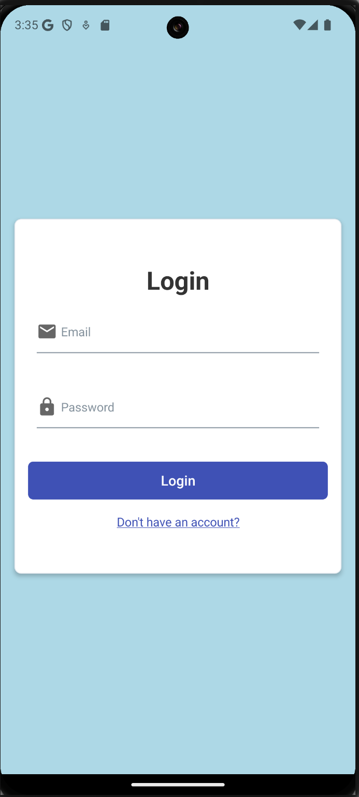
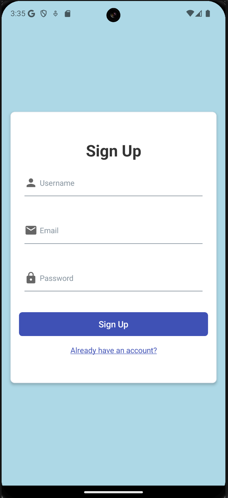
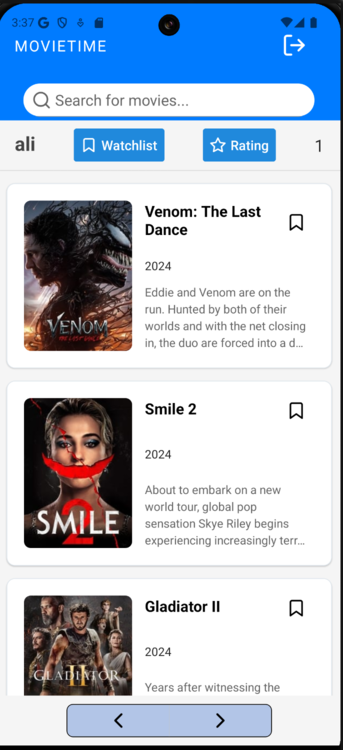
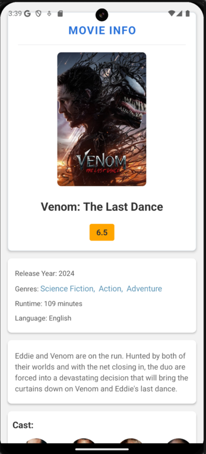
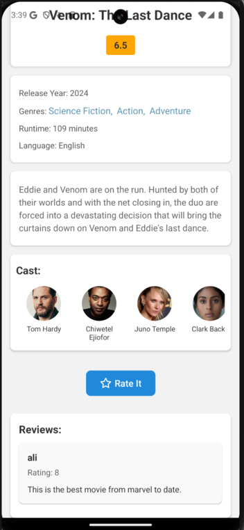
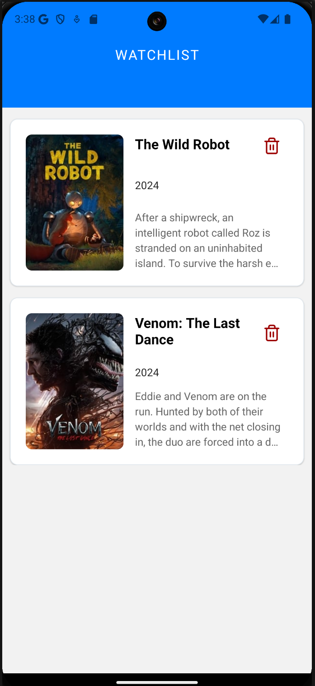

# MovieTime

**MovieTime** is a mobile application designed to provide users with movie related information.

---

## Features

1. **Movie Search and Information**
   - Search for movies by title.
   - View detailed information about movies, including cast, language and release date.

2. **Reviews and Ratings**
   - See reviews and ratings from other users.
   - Add your own ratings and reviews for movies you've watched.
   - Manage your own reviews.

3. **Watchlist Management**
   - Add movies to your watchlist.
   - Manage your watchlist.

---

## Technologies Used

- **Frontend:** JavaScript, React Native
- **Backend Services:** REST API
- **Authentication and Data Management:**
  - Firebase Auth for user authentication and email verification.
  - Firebase Firestore for storing user and movie data.

---

## Screenshots of MovieTime

### 1. **Login Screen**

---

### 2. **Signup Screen**

---

### 3. **Home Screen**

---

### 4. **Movie Information Screen**

---

### 4. **Movie Information Screen**

---

### 5. **Ratings and Reviews Screen**

---

### 6. **Watchlist Management Screen**

